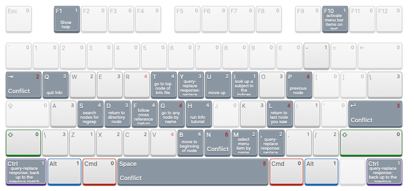

# emacs shortcut

  

## File 
```
Ctrl+X, Ctrl+F <--- Open "f"ile
```
```
Ctrl+X, Ctrl+S <--- Save
```

```
Ctrl+X, Ctrl+W <--- Save As
```

```
Ctrl+X, s  <--- Save All
``` 

```
Ctrl+X, Ctrl+V <--- Revert to File
```

```
Meta+X <--- Revert Buffer
```
```
Ctrl+X, k <--- Close Window/Buffer
```

```
Ctrl+X, Ctrl+C <--- Quit
```
